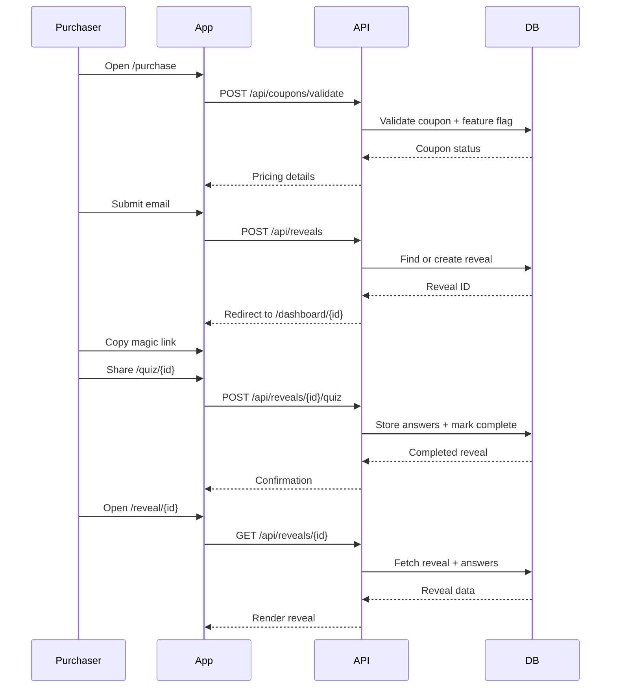
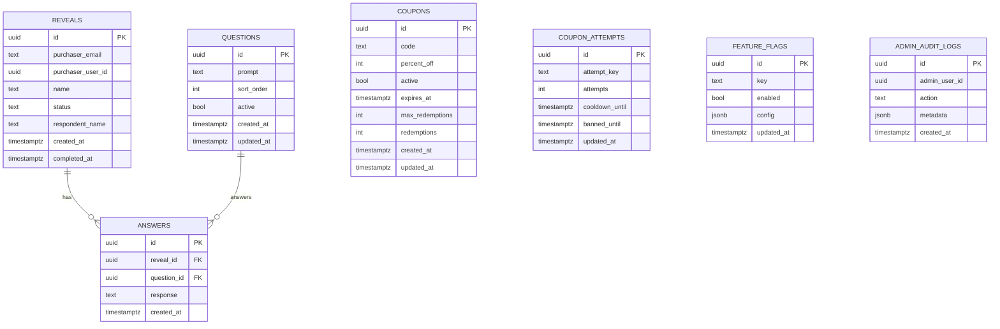

# Architecture diagrams

## Purchase and reveal flow (no payments)

```mermaid
sequenceDiagram
  participant Purchaser
  participant App
  participant API
  participant DB

  Purchaser->>App: Open /purchase
  App->>API: POST /api/coupons/validate
  API->>DB: Validate coupon + feature flag
  DB-->>API: Coupon status
  API-->>App: Pricing details
  Purchaser->>App: Submit email
  App->>API: POST /api/reveals
  API->>DB: Find or create reveal
  DB-->>API: Reveal ID
  API-->>App: Redirect to /dashboard/{id}
  Purchaser->>App: Copy magic link
  Purchaser->>App: Share /quiz/{id}
  App->>API: POST /api/reveals/{id}/quiz
  API->>DB: Store answers + mark complete
  DB-->>API: Completed reveal
  API-->>App: Confirmation
  Purchaser->>App: Open /reveal/{id}
  App->>API: GET /api/reveals/{id}
  API->>DB: Fetch reveal + answers
  DB-->>API: Reveal data
  API-->>App: Render reveal
```

## Data model

```mermaid
erDiagram
  REVEALS {
    uuid id PK
    text purchaser_email
    uuid purchaser_user_id
    text name
    text status
    text respondent_name
    timestamptz created_at
    timestamptz completed_at
  }

  QUESTIONS {
    uuid id PK
    text prompt
    int sort_order
    bool active
    timestamptz created_at
    timestamptz updated_at
  }

  ANSWERS {
    uuid id PK
    uuid reveal_id FK
    uuid question_id FK
    text response
    timestamptz created_at
  }

  COUPONS {
    uuid id PK
    text code
    int percent_off
    bool active
    timestamptz expires_at
    int max_redemptions
    int redemptions
    timestamptz created_at
    timestamptz updated_at
  }

  COUPON_ATTEMPTS {
    uuid id PK
    text attempt_key
    int attempts
    timestamptz cooldown_until
    timestamptz banned_until
    timestamptz updated_at
  }

  FEATURE_FLAGS {
    uuid id PK
    text key
    bool enabled
    jsonb config
    timestamptz updated_at
  }

  ADMIN_AUDIT_LOGS {
    uuid id PK
    uuid admin_user_id
    text action
    jsonb metadata
    timestamptz created_at
  }

  REVEALS ||--o{ ANSWERS : has
  QUESTIONS ||--o{ ANSWERS : answers
```
