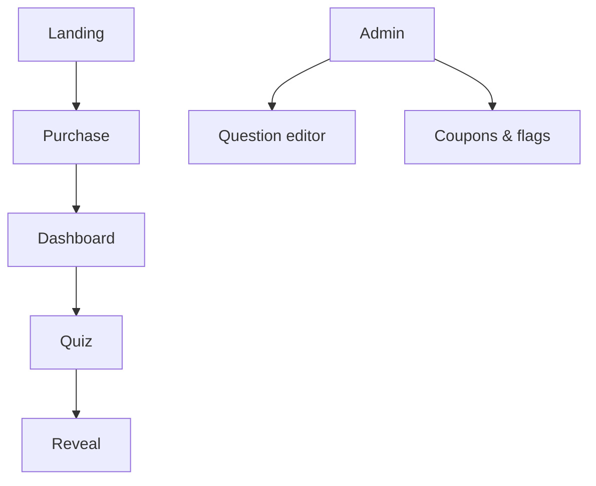
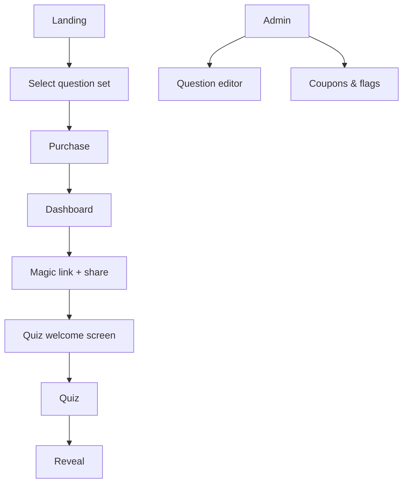
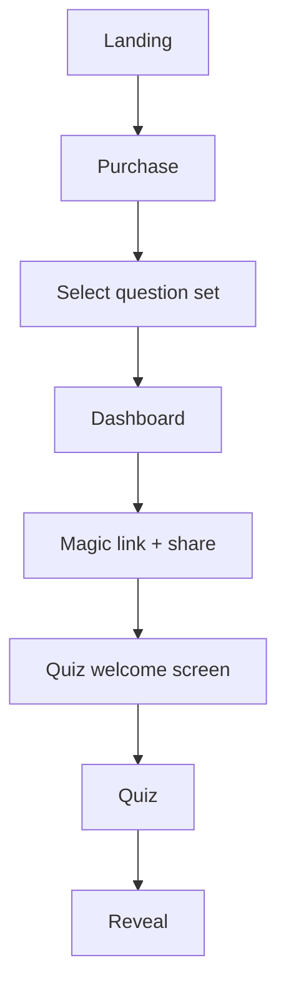
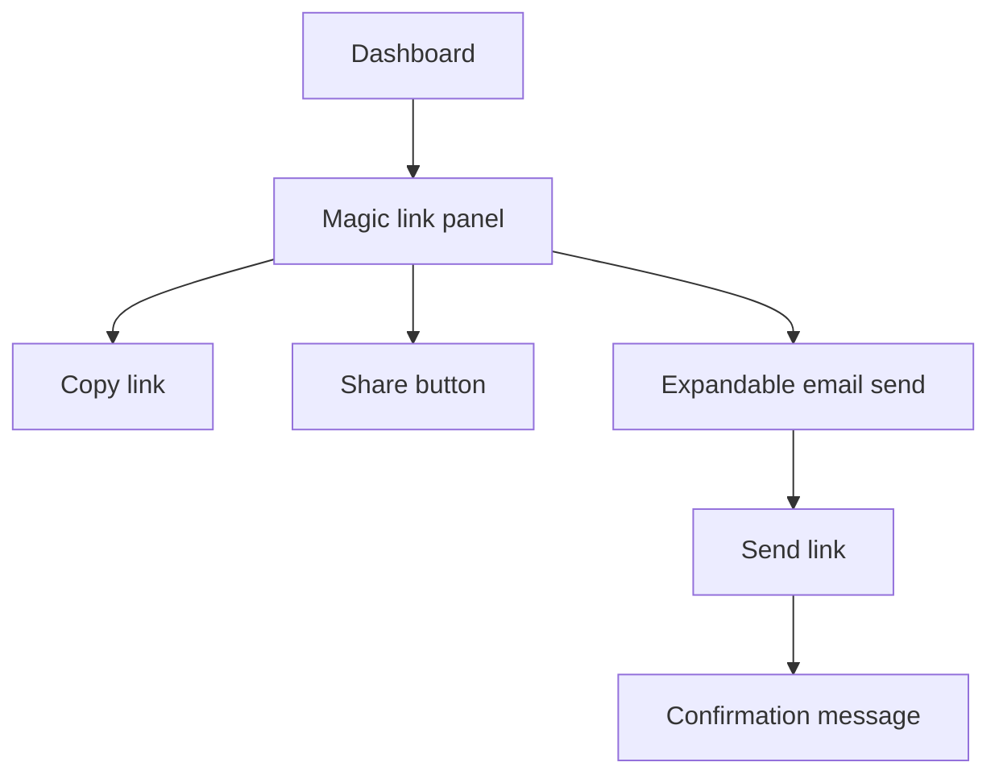
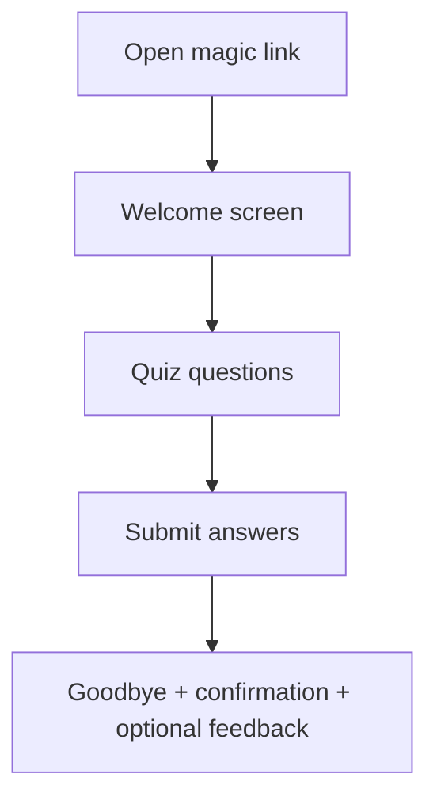
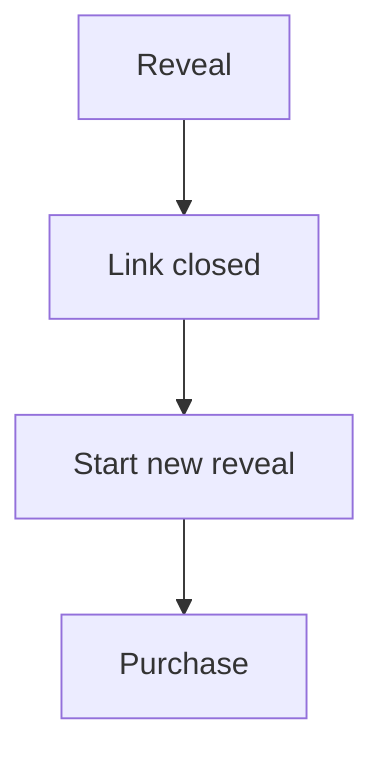
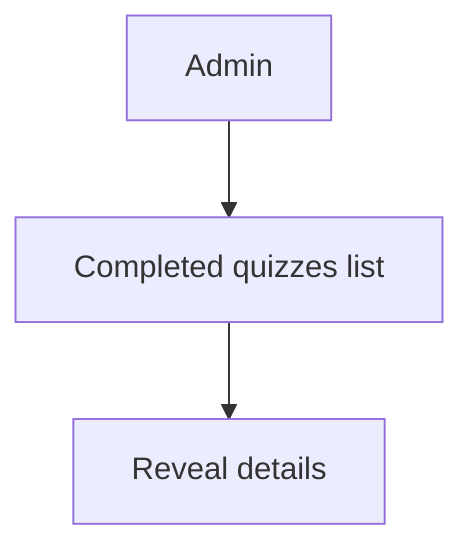
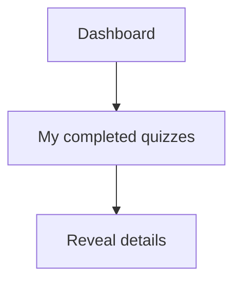

# Screen flows

## Definitions
- Admin-only list: only authorized admins can see the completed list.
- Purchaser-only list: only purchasers can see their own completed reveals.

## Current flow

## Planned flow with question set selection

## Option B flow (selection after purchase)

## Share options (feature flag)

## Dashboard status updates
- Dashboard polls for reveal completion.
- Completed reveals lock the quiz link and prompt a new purchase.

## Recipient flow (magic link)

## Post-reveal loop

## Admin-only completed list

## Purchaser-only completed list

