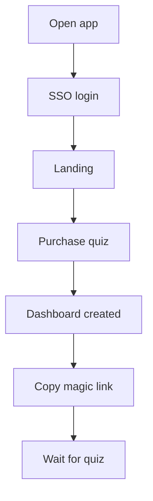
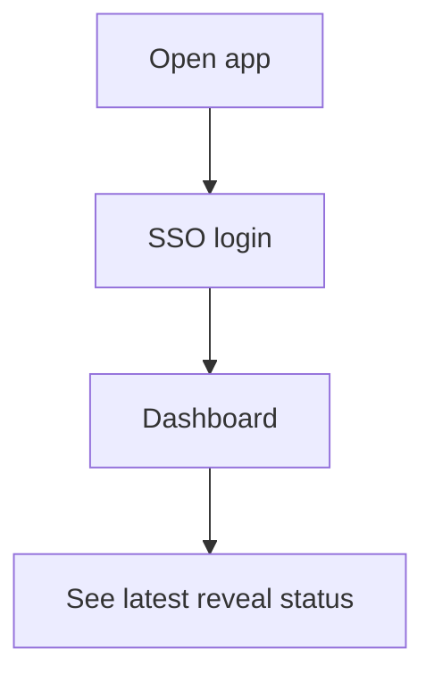
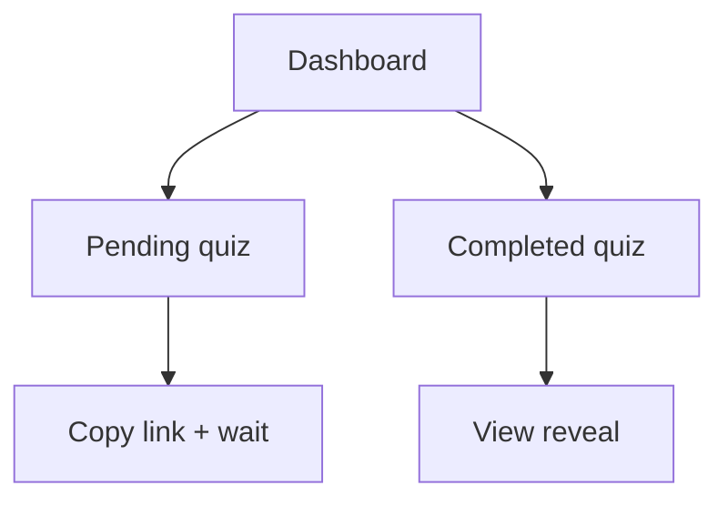

# Purchaser experience (SSO and quiz lifecycle)

## Assumptions (KISS)
- Purchaser signs in via SSO (magic link, Google, Apple).
- Purchaser can return later and see the latest reveal status.
- Completed reveals are readable multiple times until retention purge.

## First-time login flow

## Returning login flow

## Dashboard states

## Pending quiz experience
- Dashboard shows "waiting" status.
- The purchaser does NOT need to keep the page open.
- KISS improvement: light auto-refresh on the dashboard status.

## Completed quiz experience
- Dashboard shows "completed" status and a button to view the reveal.
- Reveal is readable multiple times until retention purge.
- After reading, the purchaser can return to the dashboard and re-open it.

## Confirmed choices
- Dashboard auto-refreshes while open.
- Retention window is 30 days with a visible "expires on" date.
- Purchasers see the last 3 completed reveals (more via future subscription plan).

## KISS plans (feature flags)
- Share button sits next to Copy in the magic link panel.
- All email sending is a future feature and hidden behind a feature flag.
  - Expandable input for recipient email + Send button.
  - On success, show confirmation message and send a confirmation email to
    the purchaser.
- Quiz opens with a welcome screen before questions begin.
  - Shows who sent the quiz, question count, and privacy note.
  - Welcome card is vertically centered with ~30% top offset.
- Focus rules: input/textarea auto-focus on every step; tab order moves to Next/Submit.
- Single-select questions default to the first option and are keyboard navigable.

## Draft welcome copy
"This is a quick check-in to help your partner show up for you in the ways
that matter most. Your answers stay private and are shared once. Take a few
minutes, be honest, and let them know what feels good right now."

## Open items
- Confirm whether the completed-quiz list is admin-only, purchaser-only, or both.
